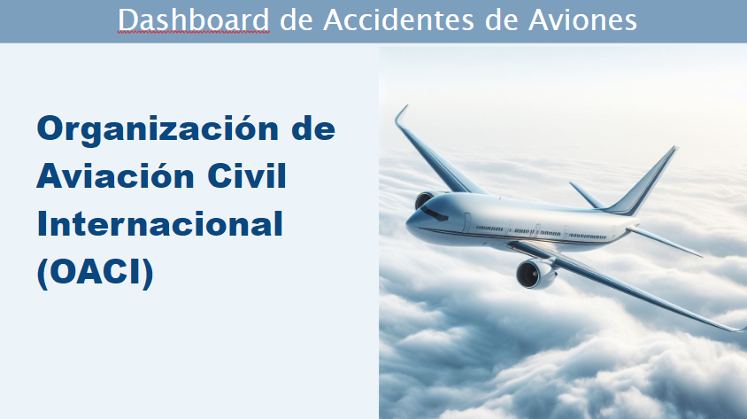
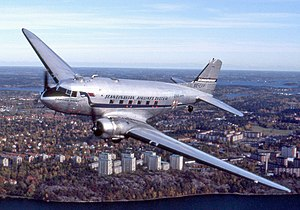
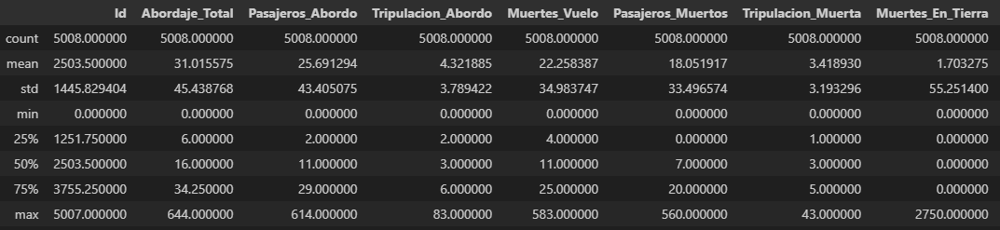
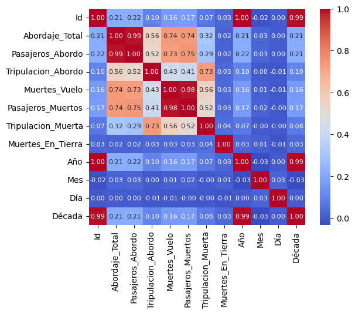
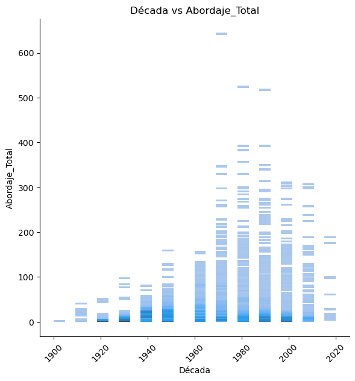
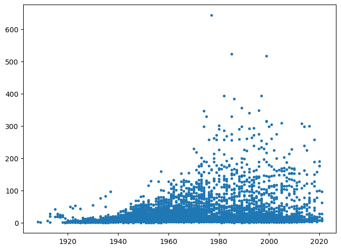
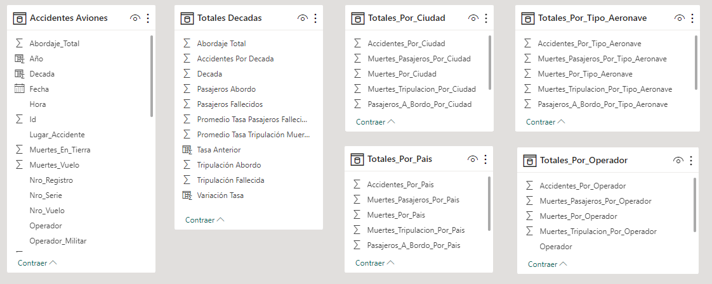

# Proyecto Individual 2 - Dashboard de Accidentes de Aviones

Este dashboard de Power BI muestra el historial de accidentes de aviones registrados desde el 17 de septiembre de 1908 hasta el 6 de julio del 2021, mostrando los índices de fatalidad de la tripulación a través de las décadas de modo que se pueda determinar los factores clave respecto a su disminución en los últimos 10 años.



## Dataset

Para el presente trabajo se utilizaron el dataset AccidentesAviones.csv Proporcionado por Henry para la realización del proyecto, que consta de 5008 filas y 18 columnas.
```
<class 'pandas.core.frame.DataFrame'>
RangeIndex: 5008 entries, 0 to 5007
Data columns (total 18 columns):
 #   Column                  Non-Null Count  Dtype         
---  ------                  --------------  -----         
 0   Unnamed: 0              5008 non-null   int64         
 1   fecha                   5008 non-null   datetime64[ns]
 2   HORA declarada          5008 non-null   object        
 3   Ruta                    5008 non-null   object        
 4   OperadOR                5008 non-null   object        
 5   flight_no               5008 non-null   object        
 6   route                   5008 non-null   object        
 7   ac_type                 5008 non-null   object        
 8   registration            5008 non-null   object        
 9   cn_ln                   5008 non-null   object        
 10  all_aboard              5008 non-null   object        
 11  PASAJEROS A BORDO       5008 non-null   object        
 12  crew_aboard             5008 non-null   object        
 13  cantidad de fallecidos  5008 non-null   object        
 14  passenger_fatalities    5008 non-null   object        
 15  crew_fatalities         5008 non-null   object        
 16  ground                  5008 non-null   object        
 17  summary                 5008 non-null   object        
dtypes: datetime64[ns](1), int64(1), object(16)
memory usage: 704.4+ KB
```
Las columnas se describen a continuación:

- ***Unnamed: 0***: Renombrado como **Id**. Un identificador numérico incremental de los accidentes.
- ***fecha***: Renombrado como **Fecha**. Un texto que contiene la fecha reportada del accidente
- ***HORA declarada***: Renombrado como **Hora**. Contiene la hora reportada del accidente en modo numérico, donde los dos primeros dígitos son la hora de 00 a 23 y los el tercer y cuarto dígitos son los minutos de 00 a 59.
- ***Ruta***: Renombrado como **Lugar_Accidente**. Contiene el lugar del accidente reportado. Es un texto que puede contener ciudad, provincia, país, el nombre del lugar o un lugar de referencia cercano y su distancia.
- ***OperadOR***: Renombrado como **Operador**. Contiene el operador del vuelo.
- ***flight_no***: Renombrado como **Nro_Vuelo**. Contiene el identificador del vuelo.
- ***route***: Renombrado como **Ruta_Vuelo**. Contiene la ruta del vuelo.
- ***ac_type***: Renombrado como **Tipo_Aeronave**. Contiene el tipo o modelo de la aeronave accidentada.
- ***registration***: Renombrado como **Nro_Registro**.Un texto que contiene el número de registro del vuelo.
- ***cn_ln***: Renombrado como **Nro_Serie**. Contiene un texto con el número de serie de la aeronave.
- ***all_aboard***: Renombrado como **Abordaje_Total**. Contiene el número total de personas a bordo del vuelo.
- ***PASAJEROS A BORDO***: Renombrado como **Pasajeros_Abordo**. Contiene el número de pasajeros a bordo del vuelo.
- ***crew_aboard***: Renombrado como **Tripulacion_Abordo**. Contiene el número de tripulantes a bordo del vuelo.
- ***cantidad de fallecidos***: Renombrado como **Muertes_Vuelo**. Contiene el número total de fallecidos en el accidente. 
- ***passenger_fatalities***: Renombrado como **Pasajeros_Muertos**. Contiene el número de pasajeros fallecidos en el accidente.
- ***crew_fatalities***: Renombrado como **Tripulacion_Muerta**. Contiene el número de tripulantes fallecidos en el accidente.
- ***ground***: Renombrado como **Muertes_En_Tierra**. Contiene el número de fallecidos en tierra a causa del accidente.
- ***summary***: Renombrado como **Resumen**. Contiene un texto con el resumen del accidente en inglés.

## Objetivo

El objetivo principal es evaluar la disminución de un 10% la tasa de fatalidad de la tripulación en los últimos 10 años con la década anterior.
Adicionalmente, se realiza un análisis del porcentaje de fatalidad de pasajeros con respecto al de tripulantes, para determinar si existe diferencias significativas entre la tasa de supervivencia de los pasajeros y de la tripulación.
Otro parámetro a evaluar es el porcentaje de accidentes con víctimas en tierra y qué factores contribuyen con este valor.

Las consignas consistieron en investigar:

- Calculo del total de tripulantes fallecidos.
- Dividir los años por décadas.
- Suma total de accidentes por décadas.  
- Calculo total de tripulantes y pasajeros fallecidos en una década.
- Cálculo de la tasa de fatalidad de tripulantes y pasajeros por década.
- Cálculo de porcentaje de accidentes con fallecidos en tierra.
- Análisis de relación de operadores y tipo de aeronave respecto a los datos calculados.

## ETL - Limpieza, transformación y carga de datos 

Los procesos de ETL se Realizaron en un notebook, donde se realizaron los sigueintes análisis:

Inicialmente se renombraron las columnas por los nombres en español que correspondan a la información contenida para evitar ambiguedades, tal como se describe en el detalle del dataset, y luego se comprobó la cantidad de valores nulos, encontrando que no existen.

Se procedió a cambiar la columna **Fecha** a datetime y luego se generaron nuevas columnas para el día, mes y año, para facilitar análisis posteriores.

Al analizar el dataset, se encontró que aparece el símbolo *'?'* cada vez que un dato no está disponible, a cambio de un **NULL**, lo que permite limpiar los datos faltantes fácilmente.

Se realizó un reemplazo en las columnas con datos de texto por ***'Unknown'*** mientras que los datos numéricos se reemplazaron por **0**.

Se hizo un análisis para determinar los operadores y los tipos de aeronaves con más accidentes.

Inicialmente se buscó la cantidad de apariciones de los valores en la columna **Operadores**, donde se obtuvo este resultado:
```
Aeroflot                            253
Military - U.S. Air Force           141
Air France                           74
Deutsche Lufthansa                   63
United Air Lines                     44
                                   ... 
Sierra Pacific Airlines               1
Pathet Lao Airlines                   1
Military - West German Air Force      1
Cessnyca                              1
Kamchatka Aviation Enterprise         1
Name: Operador, Length: 2268, dtype: int64
```

El operador con más accidentes es la aerolínea oficial del gobierno ruso Aeroflot.


También se encontró que aparecen varios operadores militares, por lo que se procedió a realizar una distinción entre vuelos militares y no militares, generando una nueva columna ***'Militar*** con valores **True/False**, obteniendo el siguiente conteo de valores:
```
False    4263
True      745
Name: Militar, dtype: int64
```

Con la columna **Tipo_Aeronave** se realizó un análisis parecido, consiguiendo los siguientes resultados:
```
Douglas DC-3                                333
de Havilland Canada DHC-6 Twin Otter 300     81
Douglas C-47A                                70
Douglas C-47                                 64
Douglas DC-4                                 41
Antonov AN-26                                35
Yakovlev YAK-40                              35
Junkers JU-52/3m                             30
De Havilland DH-4                            27
Douglas C-47B                                27
Name: Tipo_Aeronave, dtype: int64
```
El modelo con más ocurrencias es el Douglas DC-3, una de las aeronaves de mayor éxito en el transporte de pasajeros desde la década de los 30´s, e incluso algunos aviones de este modelo siguen operativos actualmente.


Se encontró que los nombres de las ubicaciones están escritos sin un formato determinado y en ocasiones con errores tipográficos. Sin embargo, realizando una manipulación de los datos se logró una diferenciación parcial de ciudades y países para analizar posteriormente las ciudades y países con más accidentes.

Se convirtieron a numérico las columnas de cantidades de personas a bordo y fallecidos, para luego totalizar y obtener los siguientes valores estadísticos:


Al buscar los años con más ocurrencias de accidentes se obtuvieron los siguientes resultados:
```
1946    88
1989    83
1947    82
1948    78
1962    78
1972    77
1945    75
1951    75
1994    74
1970    73
Name: Año, dtype: int64
```

Se creó una nueva columna de Década y al contar la cantidad de accidentes de cada década se obtuvo lo siguiente:
```
1950    652
1960    645
1990    631
1970    612
1940    580
1980    553
2000    507
1930    360
2010    238
1920    182
1910     31
2020     15
1900      2
Name: Década, dtype: int64
```

Pensando en los objetivos del análisis, se generó una gráfica de correlación de las columnas numéricas, obteniendo el siguiente resultado:



Se muestra una fuerte correlación entre los valores de *Muertes_Vuelo* y *Pasajeros_Muertos*, mientras que estas dos columnas tienen cierta correlación con los valores de *Abordaje_Total* y *Pasajeros_Abordo*.
Existe también una correlación entre *Tripulacion_Abordo* y *Tripulacion_Muerta*, y una correlación media entre estos valores y los valores de *Muertes_Vuelo* y *Pasajeros_Muertos*.
Lo que se ve también es que no existe ninguna correlación del valor de *Muertos_En_Tierra* con los demás valores.

Se graficó el valor de abordaje por década para determinar si existen outlayers que afecten el análisis, pero se ve que los valores son acorde a la evolución de los vuelso comerciales a excepción de algunos valores altos en las décadas de 1980 y 1990 pero se consideran válidos.


Se grafican las Muertes en Tierra para tratar de identificar un patrón en los valores, pero el diagrama de dispersión no denota ningún tipo de tendencia


Se hicieron algunas gráficas por mes y por día para los diferentes valores disponibles, pero no se identificaron patrones o valores para analizar.

## Modelado de datos
Se importó el dataset a Power BI. Una vez efectuadas todas las transformaciones y normalizaciones en Power Query, se procedió a generar nuevas tablas basadas en los datos importados:

- Tabla con los datos totales agrupados por década y los cálculos de tasa de fatalidad.
- Tabla con los datos agrupados por Operador.
- Tabla con los datos agrupados por tipo de aeronave.
- Tabla con los datos agrupados por Ciudad.
- Tabla con los datos agrupados por País.



## Visualización

El dashboard consta de 1 portada y 3 páginas navegables a través de una botonera de navegación.

En la primer página denominada "Historial" se puede observar la descripción del historial de vuelos desde 1930 hasta 2002 describiendo:

- Total de Id's
- Total de vuelos.
- Total fallecidos.
- Total de tripulantes fallecidos.
- Distribución de muertes por tiempos.

En la segunda página llamada "Países" se muestran el análisis por países:

- Total de vuelos por país.
- Filtro por país.
- Filtro por año.

En la tercera página llamada "Ciudad" se muestran el análisis por países:

- Total de vuelos por ciudad.
- Filtro por ciudad.
- Filtro por año.

## Insights

A lo largo del trabajo de análisis, visualización y exploración de datos, las conclusiones fueron:
